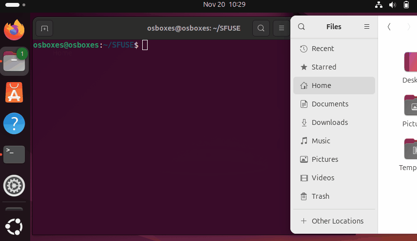

# SFUSE
SFUSE는 **Simple FUSE**의 약자입니다.

### 프로젝트 개요 및 특징

#### 1. 개요
이 프로젝트는 <b>FUSE(Filesystem in Userspace)</b>를 사용하여 구현한 간단한 파일 시스템입니다.  
FUSE는 사용자 공간에서 파일 시스템을 구현할 수 있도록 지원하는 Linux 커널 모듈입니다.  
본 프로젝트에서는 hello.txt라는 가상 파일을 제공하여, 파일 읽기 및 디렉토리 탐색과 같은 기본적인 파일 시스템의 동작을 지원하였습니다.

#### 2. 주요 기능
* hello.txt 가상 파일 생성
* 디렉토리 및 파일 속성 관리
* 파일 읽기 및 디렉토리 내용 반환

#### 3. 미리보기
<p align="center">
  
</p>


### 사용 방법
#### 1. 다운로드
이 코드를 실행하기 위해 필요한 패키지 설치와 프로젝트 다운로드를 하는 명령어입니다.
- **Ubuntu**:
  ```bash
  sudo apt install git build-essential cmake pkg-config fuse3 libfuse3-dev -y && git clone https://github.com/2daeeun/SFUSE.git
  ```
- **Arch Linux**:
  ```bash
  sudo pacman -S git cmake fuse3 && git clone https://github.com/2daeeun/SFUSE.git
  ```

#### 2. 코드 컴파일 및 마운트
mount_sfuse.sh 파일을 실행해주세요.  
해당 셸 스크립트는 컴파일과 마운트를 자동으로 해줍니다.  
```bash
./mount_sfuse.sh
```

#### 3. 언마운트 방법
```bash
umount sfuse_filesystem && rmdir sfuse_filesystem
```

##### NOTE
* 
