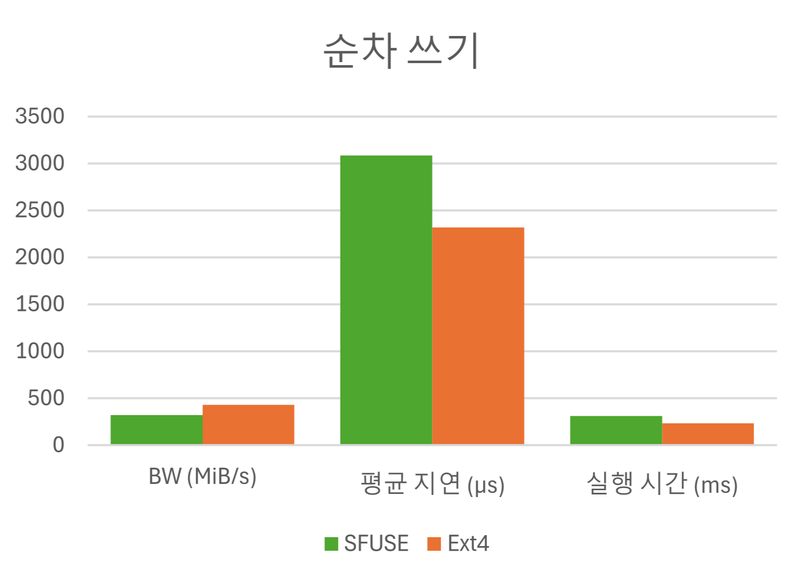
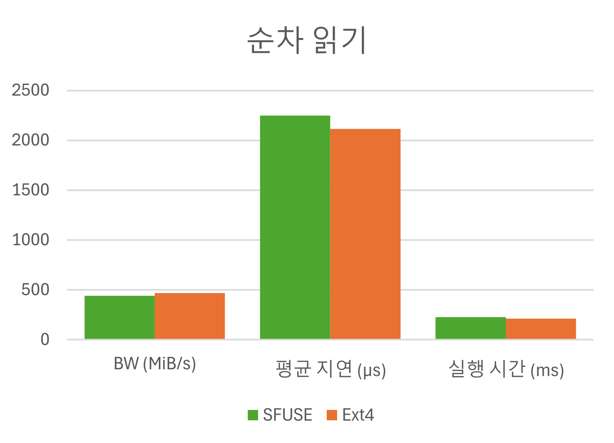
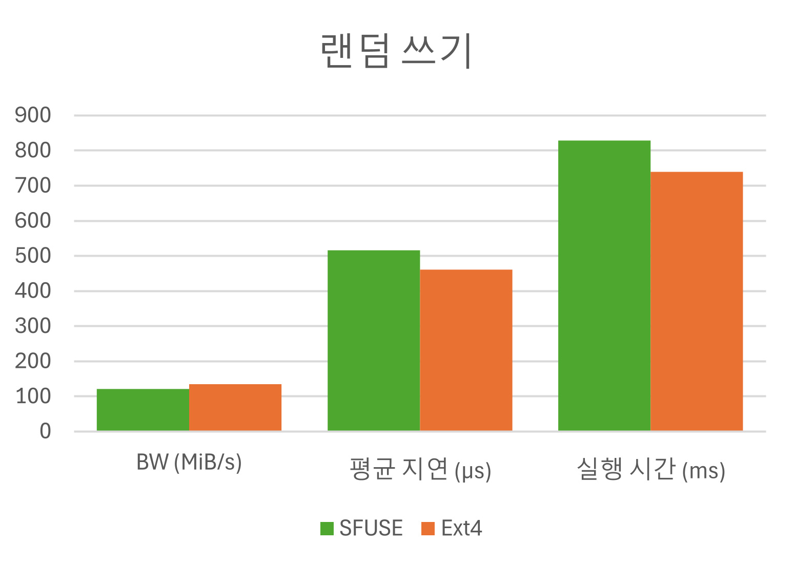
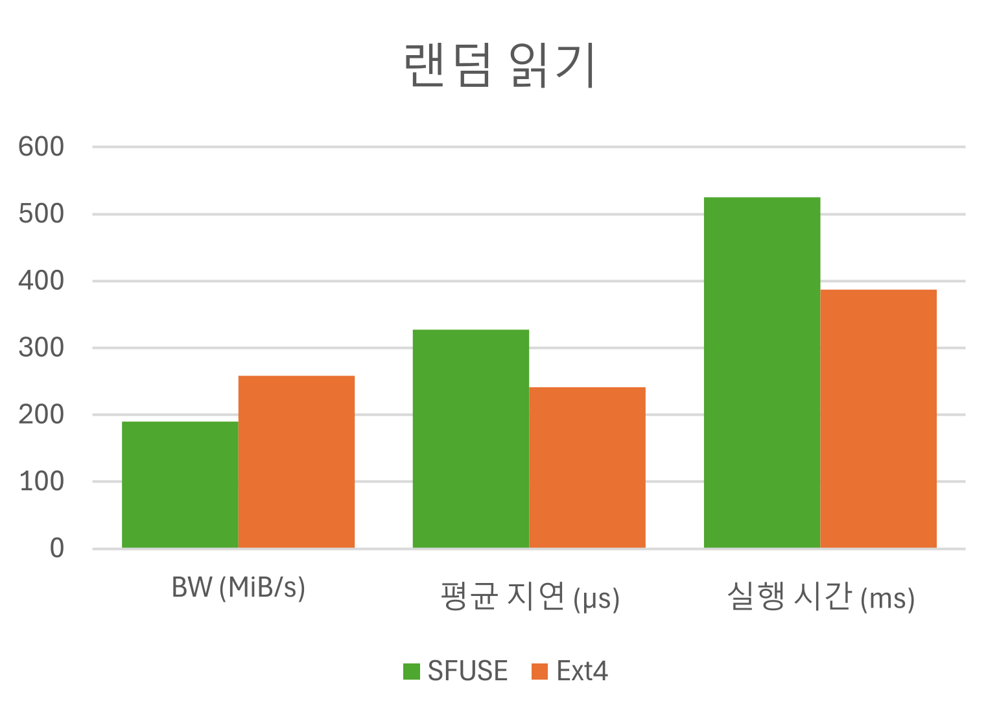

### 실험 결과

| 워크로드  | 파일시스템 | ioengine / Depth | IOPS  | BW (MiB/s) | 평균 지연 (µs) | 지연 표준편차 (µs) | 실행 시간 (ms) |
| ----- | ----- | ---------------- | ----- | ---------- | ---------- | ------------ | ---------- |
| 순차 쓰기 | SFUSE | sync / 1         | 321   | 322        | 3085       | 650.9        | 311        |
| 순차 쓰기 | Ext4  | sync / 1         | 429   | 429        | 2319       | 142.0        | 233        |
| 순차 읽기 | SFUSE | sync / 1         | 440   | 441        | 2248       | 828.7        | 227        |
| 순차 읽기 | Ext4  | sync / 1         | 469   | 469        | 2114       | 101.8        | 213        |
| 랜덤 쓰기 | SFUSE | libaio / 16      | 30.9k | 121        | 516        | 85.6         | 829        |
| 랜덤 쓰기 | Ext4  | libaio / 16      | 34.6k | 135        | 461        | 707.3        | 740        |
| 랜덤 읽기 | SFUSE | libaio / 16      | 48.8k | 190        | 327        | 77.9         | 525        |
| 랜덤 읽기 | Ext4  | libaio / 16      | 66.1k | 258        | 241        | 58.5         | 387        |

---
### 실험 결과 그래프
<table style="width:100%; table-layout:fixed;">
  <tr>
    <td style="width:50%;">
      
    </td>
    <td style="width:50%;">
      
    </td>
  </tr>
  <tr>
    <td style="width:50%;">
      
    </td>
    <td style="width:50%;">
      
    </td>
  </tr>
</table>